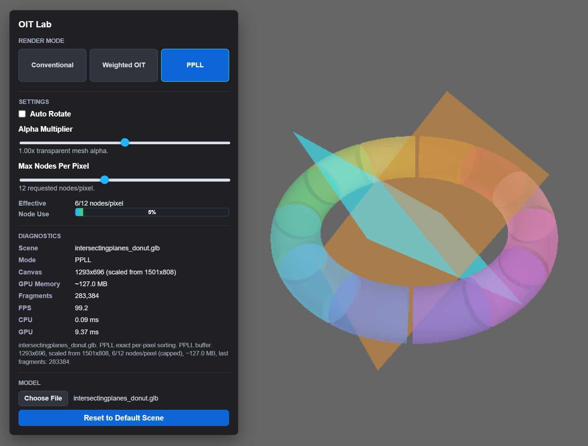

# OIT Lab

**OIT Lab** is a small Babylon.js + WebGPU transparency playground for comparing conventional alpha blending, weighted blended order-independent transparency, and exact per-pixel linked-list OIT in the same scene.



## Why This Exists

Transparent rendering is easy to make plausible and surprisingly hard to make correct. OIT Lab gives you a focused viewer where you can load transparent GLB assets, switch between transparency strategies, and see the performance and visual tradeoffs immediately.

## Features

- **Three transparency paths**: conventional back-to-front blending, weighted blended OIT, and exact per-pixel linked-list OIT.
- **Raw WebGPU renderer** driven by a Babylon.js scene/camera/loading layer.
- **Per-mode diagnostics** for FPS, CPU frame time, GPU frame time, memory use, and PPLL fragment count.
- **Transparent GLB loading** with a bundled sample asset.
- **Alpha multiplier** to quickly stress-test different transparency strengths.
- **Model auto-rotate** for inspecting overlap changes while keeping the camera fixed.
- **PPLL node budget control** for exploring quality, memory, and overflow behavior.

## Quick Start

On Windows PowerShell:

```powershell
.\start-viewer.ps1
```

The script starts a local static server and opens the viewer in your default browser. It tries these ports in order: `8080`, `5173`, `5174`, `8000`, and `3000`.

You can also serve the folder with any static HTTP server and open:

```text
index.html
```

## Requirements

- A browser with WebGPU enabled.
- A GPU/driver/browser combination that supports storage buffers for PPLL.
- Optional but recommended: WebGPU `timestamp-query` support for GPU timing diagnostics.

Babylon.js is loaded from the Babylon CDN, so the viewer needs network access unless you vendor those scripts locally.

## Render Modes

| Mode | What It Shows | Notes |
| --- | --- | --- |
| Conventional | Standard alpha blending with selectable draw order and depth write | Useful as a baseline and for demonstrating sorting artifacts. |
| Weighted OIT | Approximate order-independent transparency using accumulation and revealage buffers | Fast, stable, and often visually convincing, but not exact. |
| PPLL | Per-pixel linked-list OIT with exact per-pixel sorting | More correct for deep overlap, but substantially heavier on GPU memory and bandwidth. |

## Controls

- **Render Mode** switches between Conventional, Weighted OIT, and PPLL.
- **Auto Rotate** rotates the model while keeping the camera fixed.
- **Alpha Multiplier** scales transparent mesh alpha without modifying the source asset.
- **Enable Depth Write** controls conventional transparency depth writes.
- **Draw Order** switches conventional transparency between front-to-back and back-to-front sorting.
- **Max Nodes Per Pixel** adjusts the requested PPLL storage budget.
